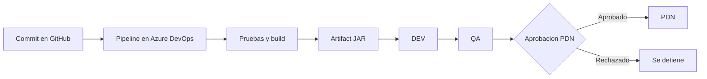
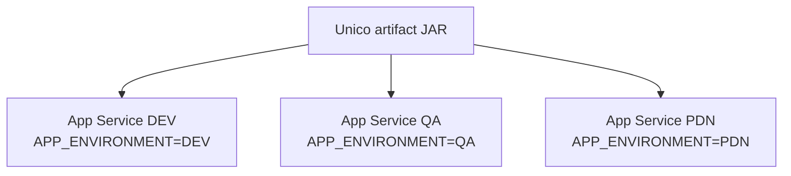
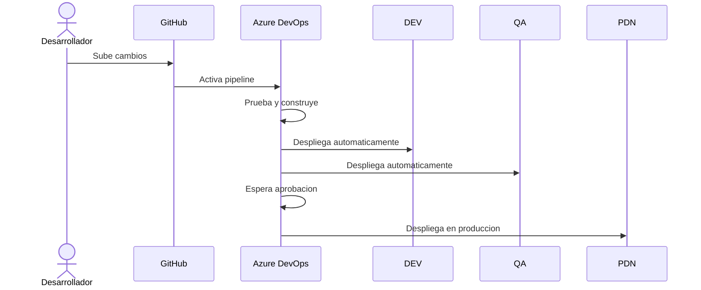

# Laboratorio DevOps Azure CI/CD

Este proyecto demuestra, de forma sencilla, como un cambio en el codigo puede pasar automaticamente por un flujo DevOps completo hasta llegar a produccion.

La aplicacion es una API pequeña hecha con **Spring Boot**. Lo importante del laboratorio no es la complejidad de la app, sino el recorrido del cambio:

```text
codigo -> pruebas -> version construida -> DEV -> QA -> aprobacion -> PDN
```

## Idea principal

Cada vez que se sube un cambio a la rama `main`, Azure DevOps ejecuta un pipeline que:

1. Construye la aplicacion.
2. Ejecuta las pruebas.
3. Genera un artifact `.jar`.
4. Despliega esa misma version en DEV.
5. Promueve la misma version a QA.
6. Espera aprobacion manual antes de pasar a PDN.
7. Despliega en PDN si la aprobacion fue aceptada.



## Que se esta demostrando

El laboratorio muestra varios conceptos importantes de DevOps:

- **Integracion continua:** el codigo se prueba automaticamente.
- **Entrega continua:** la version se mueve entre ambientes.
- **Artifact unico:** se construye una vez y se reutiliza.
- **Ambientes separados:** DEV, QA y PDN tienen su propia configuracion.
- **Aprobacion manual:** produccion no se actualiza sin control.
- **Trazabilidad:** se puede relacionar un commit con una version desplegada.

## Aplicacion

La app expone un endpoint simple:

```http
GET /api/hello
```

Respuesta esperada:

```json
{
  "message": "Hola desde DevOps",
  "environment": "DEV"
}
```

El valor de `environment` cambia segun el ambiente donde este desplegada la app:

| Ambiente | Valor esperado |
| -------- | -------------- |
| DEV      | `DEV`          |
| QA       | `QA`           |
| PDN      | `PDN`          |

## Ambientes en Azure

El proyecto usa tres App Services:

```text
app-lab-devops-dev
app-lab-devops-qa
app-lab-devops-pdn
```

Cada uno tiene configurada la variable:

```text
APP_ENVIRONMENT
```

Asi, el mismo codigo puede responder diferente sin modificar la aplicacion.



## Como validar que funciona

Abrir cada URL agregando `/api/hello` al final.

DEV debe responder:

```json
{ "message": "Hola desde DevOps", "environment": "DEV" }
```

QA debe responder:

```json
{ "message": "Hola desde DevOps", "environment": "QA" }
```

PDN debe responder:

```json
{ "message": "Hola desde DevOps", "environment": "PDN" }
```

## Como ejecutar localmente

Ejecutar pruebas:

```bash
mvn test
```

Levantar la aplicacion:

```bash
mvn spring-boot:run
```

Probar localmente:

```bash
curl http://localhost:8080/api/hello
```

Simular un ambiente:

```bash
APP_ENVIRONMENT=DEV mvn spring-boot:run
```

## Resumen visual


